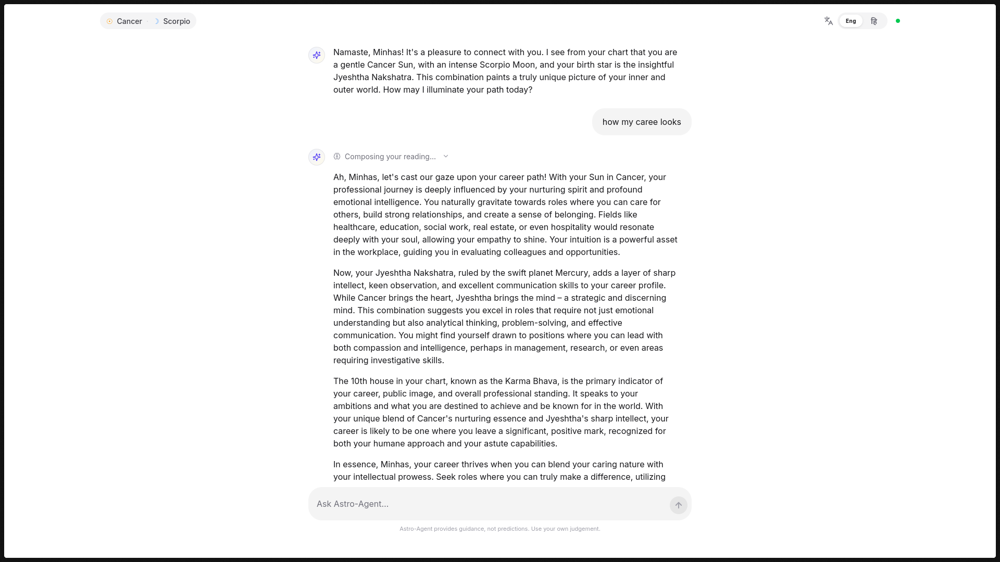
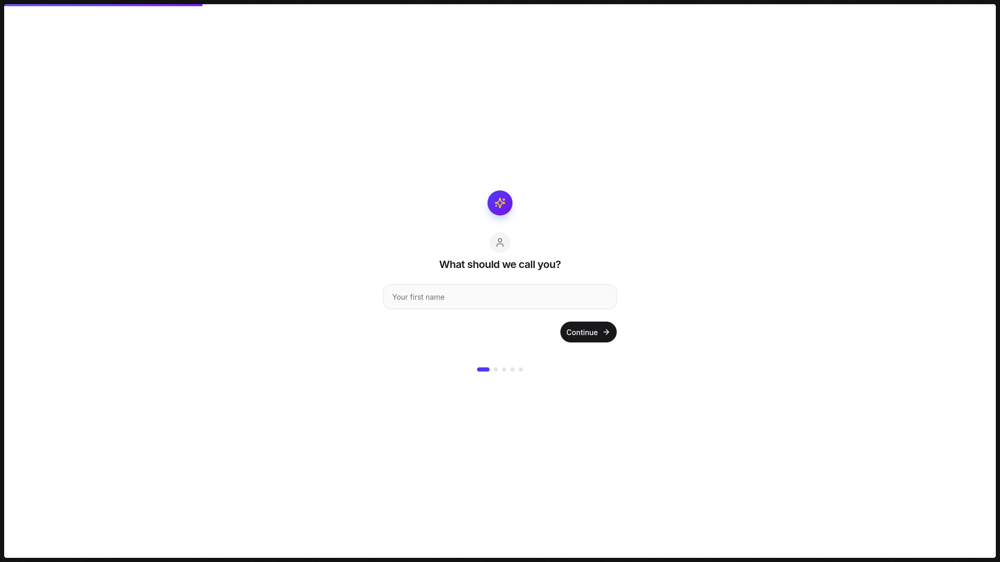
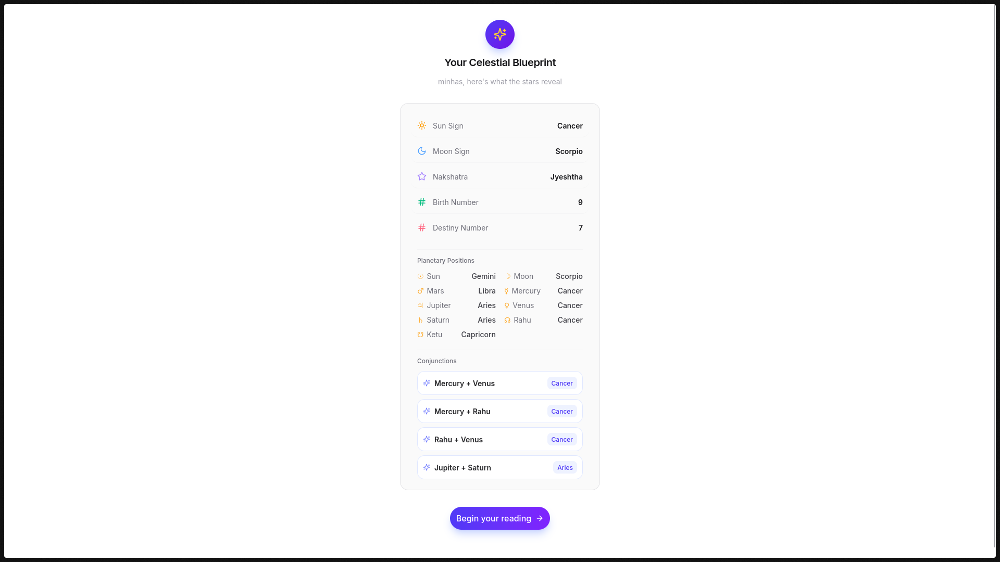
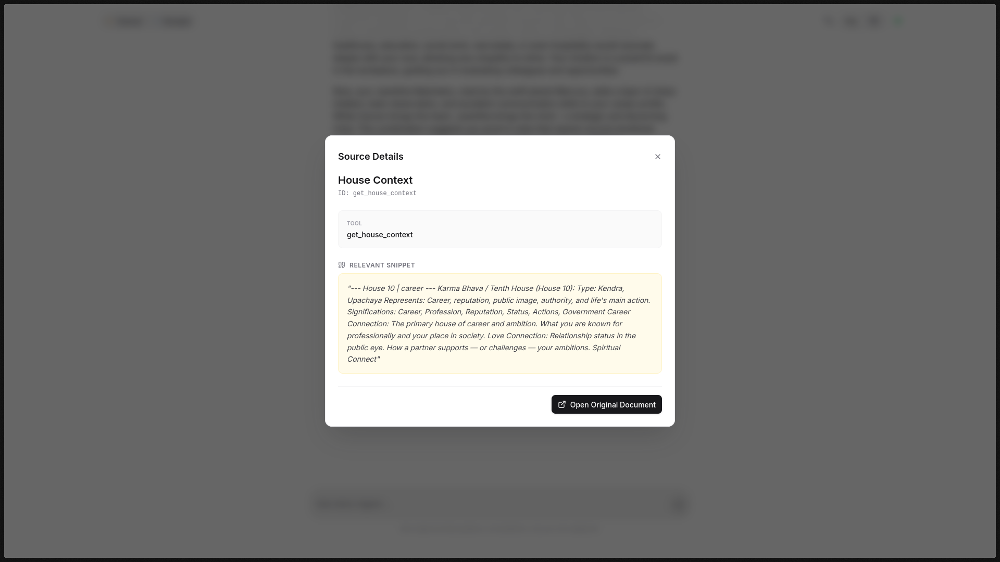

# ✨ Astro-Agent

A multi-turn, RAG-powered conversational AI that acts as a personalized **Vedic astrology (Jyotish) assistant**. It computes real birth charts using astronomical libraries, indexes a curated knowledge base into a vector store, and uses an intent-aware LLM agent to deliver grounded, personalized readings — all through real-time WebSocket streaming.

<p align="center">
  
</p>

---

## 🚀 Quick Start

> **Prerequisites:** [Docker](https://docs.docker.com/get-docker/) and a [Gemini API key](https://aistudio.google.com/apikey)

```bash
# 1. Clone the repo
git clone https://github.com/minhas1723/astro-agent.git
cd astro-agent

# 2. Add your API key
cp .env.example .env
# Edit .env → paste your GEMINI_API_KEY

# 3. Build and run (one command)
docker compose up --build
```

Open **http://localhost:4219** — the entire app (UI + API) runs from a single container.

---

## 📸 Walkthrough

<table>
  <tr>
    <td align="center" width="50%">
      <br/>
      <b>1. Onboarding</b><br/>
      <sub>Step-by-step birth details collection</sub>
    </td>
    <td align="center" width="50%">
      <br/>
      <b>2. Birth Chart</b><br/>
      <sub>Real astronomical computation — Sun, Moon, 9 planets, conjunctions</sub>
    </td>
  </tr>
  <tr>
    <td align="center" width="50%">
      <br/>
      <b>3. Chat</b><br/>
      <sub>Multi-turn conversation with thinking indicators and streaming</sub>
    </td>
    <td align="center" width="50%">
      <br/>
      <b>4. Source Citations</b><br/>
      <sub>Every answer shows which knowledge base docs were retrieved</sub>
    </td>
  </tr>
</table>

---

## 🏗️ Architecture

```
┌─────────────────────────────────────────────────────────────────┐
│                        React 19 + Bun                          │
│  OnboardingWizard → ChartReveal → Chat (WebSocket streaming)   │
└──────────────────────────┬──────────────────────────────────────┘
                           │ WS / REST
┌──────────────────────────▼──────────────────────────────────────┐
│                     FastAPI (Python 3.12)                       │
│                                                                 │
│  ┌─────────────┐  ┌──────────────┐  ┌────────────────────────┐ │
│  │  Endpoints   │  │  RAG Agent   │  │   Astrology Engine     │ │
│  │  /chart      │  │  LangChain   │  │   ephem + Lahiri       │ │
│  │  /chat (WS)  │  │  7 tools     │  │   9 planets + conj.    │ │
│  │  /health     │  │  Gemini 2.5  │  │   27 Nakshatras        │ │
│  └─────────────┘  └──────┬───────┘  └────────────────────────┘ │
│                          │                                      │
│              ┌───────────▼───────────┐                          │
│              │  ChromaDB + MiniLM    │                          │
│              │  318 indexed docs     │                          │
│              │  Metadata filtering   │                          │
│              └───────────────────────┘                          │
└─────────────────────────────────────────────────────────────────┘
```

### Tech Stack

| Layer | Technology |
|---|---|
| **LLM** | Gemini 3.0 Flash (via LangChain + LangGraph) |
| **Vector DB** | ChromaDB with ONNX MiniLM-L6-v2 embeddings (local, no API key) |
| **Backend** | FastAPI, Python 3.12, managed by `uv` |
| **Frontend** | React 19, TailwindCSS 4, Bun |
| **Astronomy** | `ephem` (PyEphem) with Lahiri Ayanamsa correction |
| **Communication** | WebSocket (real-time structured streaming) |
| **Deployment** | Multi-stage Docker build (Bun → uv → python:slim) |

---

## 🧠 Key Design Decisions

### 1. Intent-Aware RAG (Not Naive)

The agent does **not** query the knowledge base on every turn. The system prompt includes explicit decision workflows:

| User Question | Tools Called | Retrieval? |
|---|---|---|
| *"How is my career?"* | `get_sun_sign_context`, `get_nakshatra_context`, `get_house_context` | ✅ Yes |
| *"Tell me more about that"* | None — answers from conversation history | ❌ No |
| *"Summarize what you said"* | None — meta-question, no retrieval | ❌ No |
| *"Which planet affects my love life?"* | `get_planet_context`, `get_moon_sign_context` | ✅ Yes |

This is enforced through the system prompt's **§4 Decision Workflows** and **§6 Anti-Patterns** sections ([`core.py`](api/src/agent/core.py)).

### 2. Seven Scoped Retrieval Tools

Instead of a single generic "search knowledge base" tool, the agent has **7 specialized tools**, each querying ChromaDB with targeted metadata filters:

| Tool | What it retrieves | Key metadata filter |
|---|---|---|
| `get_sun_sign_context` | Personality, strengths, domain guidance | `zodiac` + `domain` |
| `get_moon_sign_context` | Emotions, inner world, stress response | `zodiac` + `domain` |
| `get_nakshatra_context` | Soul-level insight, deity, mantra | `nakshatra` + `topic` |
| `get_planet_context` | Specific planet's influence | `planet` + `domain` |
| `get_house_context` | Life area insight (career→10th house) | `house_number` |
| `get_numerology_context` | Life path, number vibrations | `number` |
| `get_conjunction_context` | Two planets combining | `planet` pair + `domain` |

Each tool is defined in [`tools.py`](api/src/agent/tools.py) with rich docstrings that guide the LLM on **when** and **how** to call them.

### 3. Real Astronomical Computation

Birth charts are **not lookup tables**. The [`core/astro/`](api/src/core/astro/) module uses the `ephem` library for actual astronomical calculation:

- **Sun sign** — Tropical zodiac date-range math
- **Moon sign + Nakshatra** — Compute tropical Moon longitude via `ephem` → subtract Lahiri Ayanamsa → sidereal position → map to one of 12 signs and 27 Nakshatras
- **9 planet positions** — Sun, Moon, Mars, Mercury, Jupiter, Venus, Saturn computed via `ephem`; Rahu/Ketu derived using Meeus mean lunar node formula
- **Conjunctions** — Planets sharing the same sidereal sign are detected and paired
- **Numerology** — Birth number (day digit-sum) and destiny number (DOB digit-sum)
- **Geocoding** — Birth place → (lat, lon) via Nominatim/geopy

### 4. WebSocket Streaming Protocol

The chat uses WebSocket with structured event types, giving the UI full visibility into agent reasoning:

```
Client → Server:  { "content": "user message" }

Server → Client:  { "type": "thinking",  "content": "Reasoning..." }
                  { "type": "tool_call", "tool_name": "get_sun_sign_context", "tool_params": {...} }
                  { "type": "chunk",     "content": "partial text..." }     // repeated
                  { "type": "done",      "sources": [{title, snippet}...] }
```

This is implemented in [`agent.py`](api/src/agent/agent.py) (`stream_events`) and consumed by [`ChatContext.tsx`](ui/src/contexts/ChatContext.tsx).

### 5. Session Memory

- **Per-session `InMemoryChatMessageHistory`** keyed by WebSocket session ID
- History is injected into each LLM call alongside the system prompt and user context
- The system prompt explicitly instructs the agent to **skip retrieval** for follow-ups and meta-questions, preventing context contamination and saving tokens

### 6. Knowledge Base Chunking

Each of the 9 data files has a **dedicated chunker** in [`chunkers.py`](api/src/core/retrieval/chunkers.py) (471 lines) that produces semantically meaningful documents with rich metadata:

- **JSON files** → One document per `(entity × topic)` — e.g., *Scorpio × career*, *Jupiter × spiritual*
- **TXT guidance files** → One document per `[SECTION]` tag via regex parsing
- All chunks include metadata: `source`, `zodiac`, `planet`, `domain`, `topic`, `house_number`, etc.
- **318 total documents** indexed at startup

### 7. Localization

The WebSocket connection accepts a `language` query parameter (`English` | `Hindi`). This is injected into the system context, and the agent responds in the requested language using Devanagari script for Hindi.

---

## 📁 Project Structure

```
astro-agent/
├── docker-compose.yml          # One-command deployment
├── Dockerfile                  # 3-stage build (Bun → uv → python:slim)
├── .env.example                # Template — copy to .env
│
├── api/                        # Python backend
│   ├── main.py                 # FastAPI app factory + SPA serving + startup indexing
│   └── src/
│       ├── agent/
│       │   ├── agent.py        # RAGAgent — stream() + stream_events()
│       │   ├── core.py         # Gemini model, system prompt, session memory
│       │   └── tools.py        # 7 scoped retrieval tools
│       ├── core/
│       │   ├── config.py       # Pydantic Settings (env-based config)
│       │   ├── astro/          # Astronomical computation
│       │   │   ├── sun_sign.py # DOB → tropical Sun sign
│       │   │   ├── moon.py     # ephem + Lahiri → sidereal Moon sign + Nakshatra
│       │   │   ├── planets.py  # 9-planet positions + conjunction detection
│       │   │   ├── numerology.py
│       │   │   └── geocoder.py # Place → (lat, lon) via Nominatim
│       │   └── retrieval/      # RAG pipeline
│       │       ├── store.py    # ChromaDB client (ONNX MiniLM-L6-v2)
│       │       ├── indexer.py  # Startup indexer — routes files to chunkers
│       │       ├── chunkers.py # 7 file-specific chunkers (471 lines)
│       │       └── search.py   # Semantic search + metadata filtering
│       └── endpoints/
│           ├── health.py       # GET /health
│           ├── chart.py        # POST /api/v1/chart/calculate
│           └── chat.py         # WS /api/v1/chat/ws
│
├── ui/                         # React frontend
│   ├── build.ts                # Custom Bun build script
│   └── src/
│       ├── App.tsx             # Router + providers + onboarding gate
│       ├── components/
│       │   ├── OnboardingWizard.tsx  # 5-step birth details form
│       │   ├── ChartReveal.tsx      # Animated chart display
│       │   ├── chat.tsx             # Chat UI (messages, markdown, sources)
│       │   └── ThinkingBlock.tsx    # Agent reasoning timeline
│       ├── contexts/
│       │   ├── ChatContext.tsx  # WebSocket + message state machine
│       │   └── UserContext.tsx  # Session persistence (sessionStorage)
│       └── lib/
│           └── api.ts          # API config (auto-detects prod vs dev)
│
├── data/                       # Knowledge base (9 files, indexed at startup)
│   ├── zodiac_traits.json      # 12 signs × personality, career, love, challenges
│   ├── planetary_impacts.json  # 9 planets × description, career/love/spiritual
│   ├── nakshatra_mapping.json  # 27 Nakshatras × personality, career, spiritual
│   ├── houses.json             # 12 houses with life area connections
│   ├── conjunctions.json       # Planetary conjunction effects
│   ├── numerology.json         # Numbers 1–9 with meanings
│   ├── career_guidance.txt     # Per-sign career guidance
│   ├── love_guidance.txt       # Per-sign love guidance
│   └── spiritual_guidance.txt  # Per-sign spiritual guidance
│
└── screenshots/                # UI screenshots
```

---

## 🔌 API Reference

| Route | Method | Description |
|---|---|---|
| `/health` | GET | Health check → `{status, version, project}` |
| `/api/v1/chart/calculate` | POST | Compute birth chart from user details |
| `/api/v1/chat/ws` | WebSocket | Real-time streaming chat with the agent |
| `/{path}` | GET | SPA catch-all (serves built UI) |

### Chart Calculation

```bash
curl -X POST http://localhost:4219/api/v1/chart/calculate \
  -H "Content-Type: application/json" \
  -d '{
    "name": "Ritika",
    "email": "ritika@example.com",
    "dob": "1995-08-20",
    "birth_time": "14:30",
    "birth_place": "Jaipur, India"
  }'
```

**Response:**
```json
{
  "sun_sign": "Leo",
  "moon_sign": "Aries",
  "nakshatra": "Bharani",
  "birth_number": 2,
  "destiny_number": 7,
  "planetary_positions": {
    "Sun": "Cancer", "Moon": "Aries", "Mars": "Virgo",
    "Mercury": "Leo", "Jupiter": "Scorpio", "Venus": "Cancer",
    "Saturn": "Aquarius", "Rahu": "Virgo", "Ketu": "Pisces"
  },
  "conjunctions": [
    { "planets": ["Mars", "Rahu"], "sign": "Virgo" }
  ]
}
```

---

## 📚 Knowledge Base

| File | Entries | Chunking Strategy |
|---|---|---|
| `zodiac_traits.json` | 12 signs × 5 topics = **60 chunks** | One doc per (sign × topic) |
| `planetary_impacts.json` | 9 planets × 4 topics = **36 chunks** | One doc per (planet × topic) |
| `nakshatra_mapping.json` | 27 nakshatras × 4 topics = **108 chunks** | One doc per (nakshatra × topic) |
| `houses.json` | 12 houses = **12 chunks** | One doc per house |
| `conjunctions.json` | 12 conjunctions = **12 chunks** | One doc per conjunction |
| `numerology.json` | 9 numbers = **9 chunks** | One doc per number |
| `career_guidance.txt` | **26 chunks** | One doc per `[SECTION]` tag |
| `love_guidance.txt` | **26 chunks** | One doc per `[SECTION]` tag |
| `spiritual_guidance.txt` | **29 chunks** | One doc per `[SECTION]` tag |
| **Total** | | **318 documents** |

All chunks include metadata fields (`zodiac`, `planet`, `domain`, `topic`, `house_number`, etc.) enabling **filtered semantic search** — the agent doesn't just search by similarity, it narrows by the exact metadata relevant to the user's question.

---

## 🛠️ Local Development

For development without Docker, run the backend and frontend separately:

### Backend (API)

```bash
cd api

# Install dependencies
uv sync

# Set your API key
echo "GEMINI_API_KEY=your-key-here" > .env

# Run the development server
uv run python main.py
# → http://localhost:4219
```

### Frontend (UI)

```bash
cd ui

# Install dependencies
bun install

# Run the dev server (with HMR)
bun run dev
# → http://localhost:3000 (proxies API calls to :4219)
```

---

## 📋 Assignment Checklist

| Requirement | Status | Implementation |
|---|---|---|
| **API Layer** (FastAPI `/chat`) | ✅ | REST + WebSocket endpoints |
| **Conversation Layer** (session memory) | ✅ | Per-session `InMemoryChatMessageHistory` |
| **LLM Layer** (model abstraction) | ✅ | LangChain + Gemini 2.5 Flash |
| **Retrieval Layer** (vector search) | ✅ | ChromaDB + ONNX MiniLM-L6-v2 (318 docs) |
| **Intent-Aware Retrieval** | ✅ | System prompt decision workflows |
| **Memory Control** | ✅ | Bounded history + anti-retrieval rules |
| **Hindi Toggle** | ✅ | Language selector in UI + system context |
| **Error Handling** | ✅ | Validation, fallback search, WS error frames |
| **Zodiac sign** (mandatory) | ✅ | Computed from DOB (tropical) |
| **Moon sign** (bonus) | ✅ | `ephem` + Lahiri Ayanamsa (sidereal) |
| **Nakshatra** (bonus) | ✅ | 27 Nakshatras from sidereal Moon longitude |
| **Numerology** (bonus) | ✅ | Birth number + destiny number |
| **Planetary positions** (bonus) | ✅ | 9 planets sidereal positions |
| **Conjunctions** (bonus) | ✅ | Auto-detected planet pairs in same sign |
| **Full UI** (bonus) | ✅ | React 19 with onboarding, chart reveal, streaming chat |
| **Docker deployment** (bonus) | ✅ | Single `docker compose up --build` |

---

<p align="center">
  <sub>Built with the help of Claude Opus 4.6 & Gemini 3.1 in <a href="https://antigravity.dev">Antigravity IDE</a></sub>
</p>
